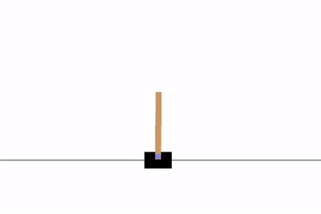
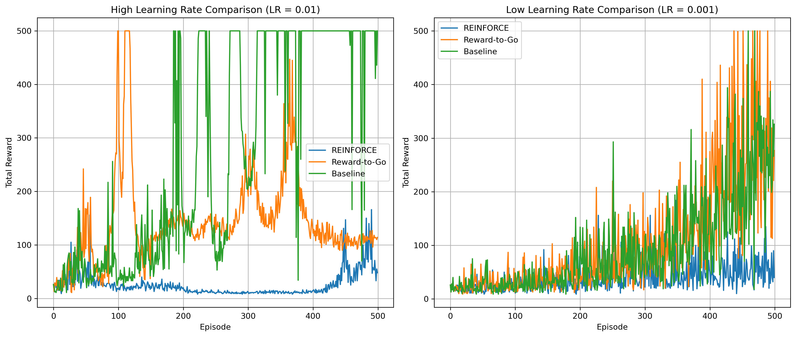
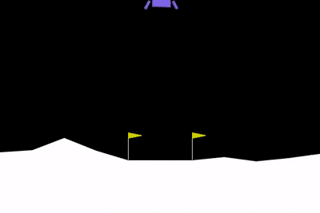
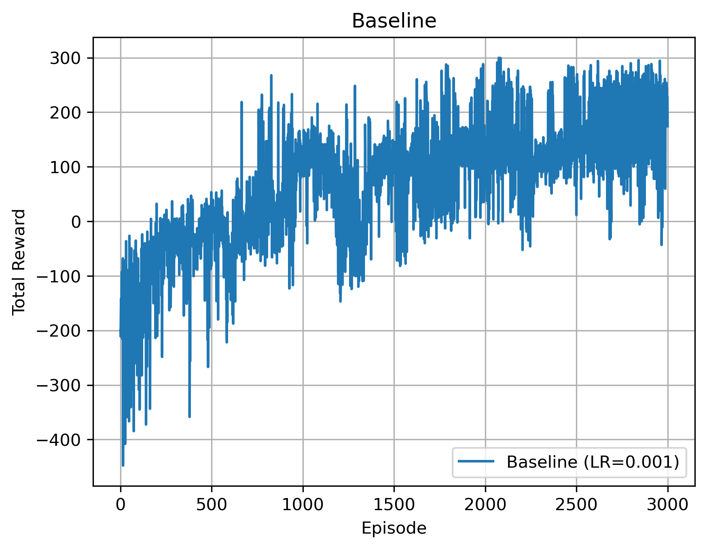
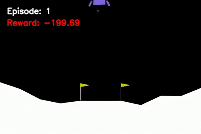

# Introduction to Reinforcement Learning (REINFORCE Algorithm)

Implementation of the **REINFORCE** algorithm applied to classical control and continuous state tasks using OpenAI Gymnasium environments: **CartPole-v1** and **LunarLander-v3**.

The notebook (`intro-to-rl_homework.ipynb`) follows a workflow:

- **Imports & Setup:** Initialization of standard Reinforcement Learning libraries like `gymnasium`.
- **Policy Networks (`PolicyNet`):**
   - **CartPole:** A single-hidden-layer MLP with 64 neurons and ReLU activation.
   - **LunarLander:** A deeper MLP with two hidden layers of 128 neurons each and ReLU activations, designed to better capture the increased complexity of the LunarLander environment.
- **REINFORCE Algorithm implementation:** Trajectory generation, log-probability tracking, evaluation loops, and baseline comparisons.
 

### 1. CartPole-v1
- **Goal:** Balance a pole attached by an un-actuated joint to a cart moving along a frictionless track.
- **Max Score Achieved:** **500.0** (Perfect Score) 
- **Demonstration:**

  
<strong>Episode: 240 | Reward: 500</strong>

  

This figure compares the performance of three policy gradient methods, **REINFORCE**, **REINFORCE with Reward-to-Go**, and **REINFORCE with Baseline**, on the **CartPole-v1** environment using two learning rates (**0.01** and **0.001**) over **500 training episodes**.

### * Comparison with Learning Rate = 0.01 (Left Plot)

* **REINFORCE (Blue):**

  * The algorithm performs poorly, with rewards remaining mostly between **10 and 30** throughout the majority of the training process.
  * Only toward the end of training does the reward increase to approximately **100–160**, but it still fails to achieve stable performance.
  * This behavior suggests that a learning rate of **0.01** is too large for the standard REINFORCE algorithm, resulting in unstable gradient updates.

* **Reward-to-Go (Orange):**

  * It learns considerably faster than the standard REINFORCE algorithm.
  * During several periods of training, it reaches the maximum reward of **500**, indicating that the environment is successfully solved.
  * However, its performance remains highly unstable, frequently dropping after achieving high rewards.

* **Baseline (Green):**

  * Starting from approximately **episode 180**, the algorithm reaches the maximum reward of **500** multiple times.
  * Although occasional performance drops are still observed, it remains at high reward levels for longer periods than the other two methods.
  *

---

### * Comparison with Learning Rate = 0.001 (Right Plot)

* **REINFORCE (Blue):**

  * The learning process is noticeably smoother and more stable than with the higher learning rate.
  * However, learning progresses slowly, and even after **500 episodes**, the reward generally remains below **100**.

* **Reward-to-Go (Orange):**

  * It exhibits a gradual and relatively consistent improvement throughout training.
  * Significant performance gains become apparent after approximately **episode 350**.
  * By the end of training, it reaches the maximum reward of **500** multiple times.
  * Compared with the higher learning rate, its performance is less volatile and follows a more stable learning trajectory.

* **Baseline (Green):**

  * The algorithm improves steadily over time and reaches the maximum reward of **500** several times near the end of training.
  * Although some fluctuations are still present, its performance is considerably more stable than with a learning rate of **0.01**.

Overall, the experimental results demonstrate that both <strong>Reward-to-Go</strong> and, in particular, <strong>Baseline</strong> outperform the standard <strong>REINFORCE</strong> algorithm by learning more efficiently and achieving higher rewards. Furthermore, a learning rate of <strong>0.001</strong> provides more stable training and more reliable convergence than <strong>0.01</strong>. Although the larger learning rate occasionally enables the algorithms to achieve the maximum reward of <strong>500</strong>, the resulting training process is highly unstable and fails to maintain consistent performance.

In the case of the <strong>Baseline</strong> method with a learning rate of <strong>0.001</strong>, these instabilities are mainly caused by the large learning rate, which produces overly aggressive gradient updates even after the policy has reached a good solution. In addition, the baseline used in this implementation is simply the average return of the current episode and therefore cannot fully reduce the variance of the policy gradient estimates. Consequently, the combination of residual gradient noise and large update steps leads to temporary performance drops after reaching the maximum reward.

---
### 2. LunarLander-v3 (Baseline)
- **Goal:** Navigate a lander to its landing pad safely under fuel constraints.
- **Hyperparameters:**
  - **Learning Rate (LR):** `0.001`
  - **Total Training Episodes:** `3000`
  - **Demonstration:**
    

  
<strong>Episode: 2600 | Reward: 242</strong>

  

Training LunarLander:

  

Exports video checkpoints every 100 episodes

  

  
   

  
  
